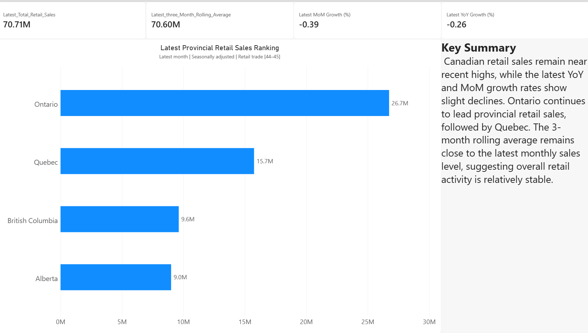

# Canadian Retail & E-commerce Performance Analysis

## Project Overview

This project analyzes Canadian retail and e-commerce performance from 2019 to 2026 using Statistics Canada data.

The analysis focuses on:

- Canadian retail sales trends
- Provincial retail performance
- Year-over-Year and Month-over-Month growth
- 3-month rolling averages
- Provincial sales rankings
- Canadian e-commerce sales growth
- E-commerce share of total retail sales

The project uses **Python** for data ingestion and initial inspection, **MySQL** for data cleaning and analysis, and **Power BI** for dashboard development and visualization.

---

## Dashboard Preview

### Executive Overview



### Retail Sales Trends


### Provincial Retail Sales Ranking


### E-commerce Analysis


---

## Business Questions

This project aims to answer the following questions:

- How have Canadian retail sales changed from 2019 to 2026?
- How do Ontario, Quebec, British Columbia, and Alberta compare in retail sales performance?
- What are the latest YoY and MoM retail sales growth rates?
- What does the 3-month rolling average indicate about recent retail trends?
- Which provinces currently lead Canadian retail sales?
- How have Canadian e-commerce sales changed over time?
- How has e-commerce's share of total retail sales changed since 2019?

---

## Data Source

The data was obtained from **Statistics Canada**.

Main dataset:

**Monthly retail trade sales by province and territory**

Statistics Canada Table ID:

`20-10-0056-01`

The dataset contains monthly retail sales information by:

- Reference date
- Geography
- Sales type
- Seasonal adjustment
- NAICS industry
- Sales value

The main retail analysis focuses on:

- Canada
- Ontario
- Quebec
- British Columbia
- Alberta

The analysis uses:

- Total retail sales
- Retail e-commerce sales
- Seasonally adjusted data
- Retail trade [44-45]

---

## Tools Used

- **Python**
  - pandas
  - requests
- **MySQL**
- **DataGrip**
- **Power BI**
- **CSV / Excel**
- **Git**
- **GitHub**

---

## Data Collection

Statistics Canada data was downloaded programmatically using Python from the official CSV download endpoint.

Python was used to inspect:

- Dataset dimensions
- Column names
- Data types
- Missing values
- Geography coverage
- Sales categories
- Seasonal adjustment categories
- NAICS classifications

---

## Data Cleaning & Preparation

### Missing Values

Missing sales values were investigated by geography.

The highest missing-value rates were concentrated in smaller regions, including:

- Nunavut
- Northwest Territories
- Yukon
- Prince Edward Island

The main analysis therefore focuses on larger geographies with more complete data.

### Data Type Conversion

The `VALUE` field was imported into MySQL as text, so it was converted into a numeric type before analysis:

```sql
CAST(VALUE AS DECIMAL(15,2))
